### Fhflow 
- 基于react+rudex+electron+node整体设计的前端开发环境集成工具  
- 当前fhflow提供的主要模块包括：当前前端工作的基本工作流、请求代理、数据模拟、开发文档、开发环境检测安装及常用工具下载  
- 当前前端工作的基本工作流主要包括开发模式、上传模式、打包模式等功能。支持模块化和非模块化开发  
- 请求代理模块提供代理设置功能  
- 数据模块提供rap安装文档入口
- 开发文档模块提供常用前端开发文档的快速入口   
- 开发环境安装模块提供开发环境检测与安装，同时提供常用工具的下载功能  


### 安装使用
- 下载安装包 fhflow-1.0.0-setup.exe
- 安装fhflow-1.0.0-setup.exe

### 界面预览
#### 主界面图示
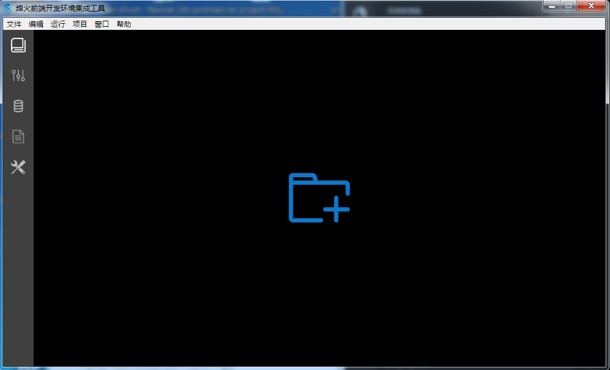

#### 主菜单
    文件
    ├── 新建项目
    ├── 打开项目
    ├── 刷新
    编辑
    ├── 撤销
    ├── 重做
    ├── 剪切
    ├── 复制
    ├── 粘贴
    ├── 全选
    运行
    ├── Run 开发流程
    ├── Ftp 发布部署
    ├── Pack 项目打包
    项目
    ├── 删除当前项目
    窗口
    ├── 最小化
    ├── 关闭窗口
    ├── 调试模式
    帮助
    ├── FhFlow 官网
    ├── FhFlow 使用帮助
    ├── 报告问题
    ├── 检查更新
    ├── 关于


### 如何使用，Let's do it !

#### 项目管理
+ 界面结构

  * 项目管理的页面主要分为左侧上半部分的项目列表区，左侧中间部分的操作区，左侧下半部分的日志区，以及右侧的项目设置区和开发高级设置区
  * 项目列表区展示项目列表，可以在此处打开项目的所在路径以及修改项目名称
  操作区可以新建项目、删除项目、修改工作区、对选中的项目进行开发、上传、打包等操作
  * 日志区会记录开发、上传、打包等操作的进度，同时提供了清空图标可以对日志进行清空
  * 项目设置区主要对开发、上传、打包功能进行设置
  * 开发高级设置,在此处对项目进行高级设置。例如设置是否含有模块、项目类型等。默认为非模块化项目，项目类型为普通类型
  
  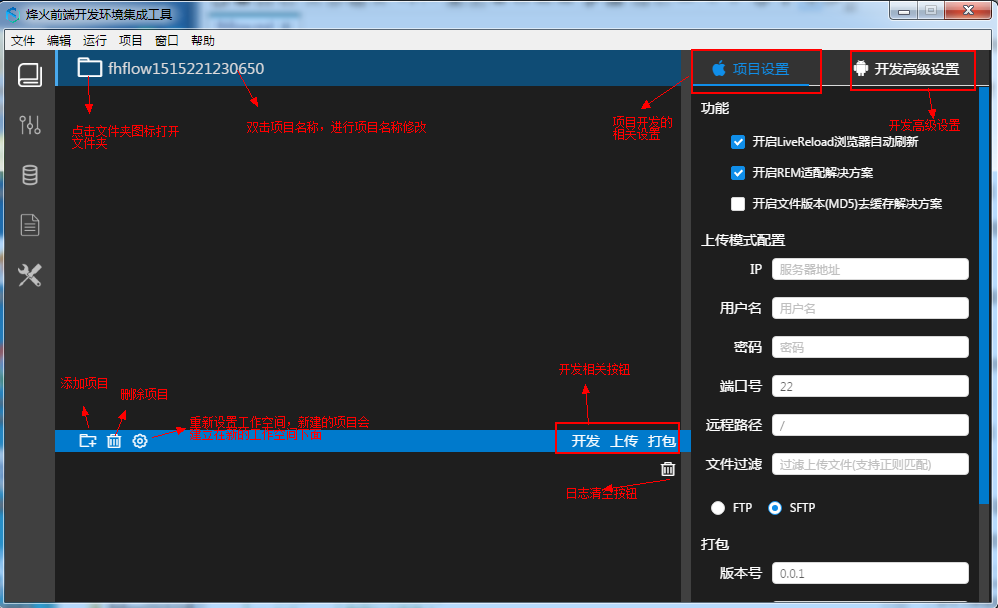

+ 修改全局工作区路径

  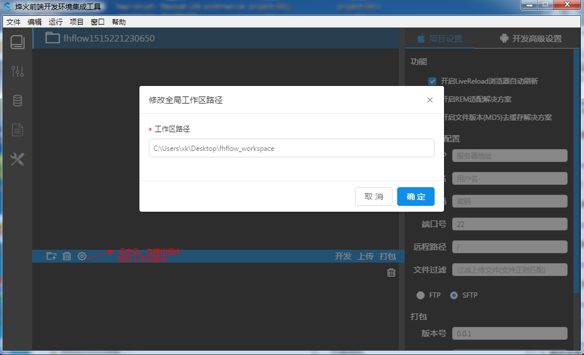
  
+ 新建项目

  a. 任何项目情况下新建项目

  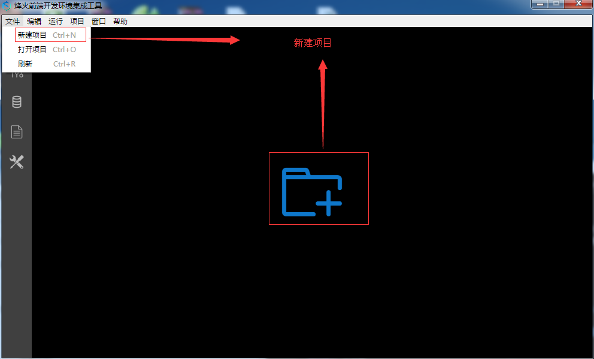

  b. 项目情况下新建项目

  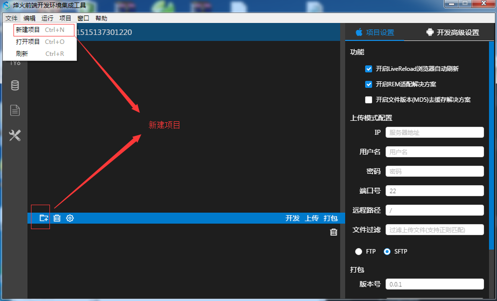

  c. 打开已有项目

  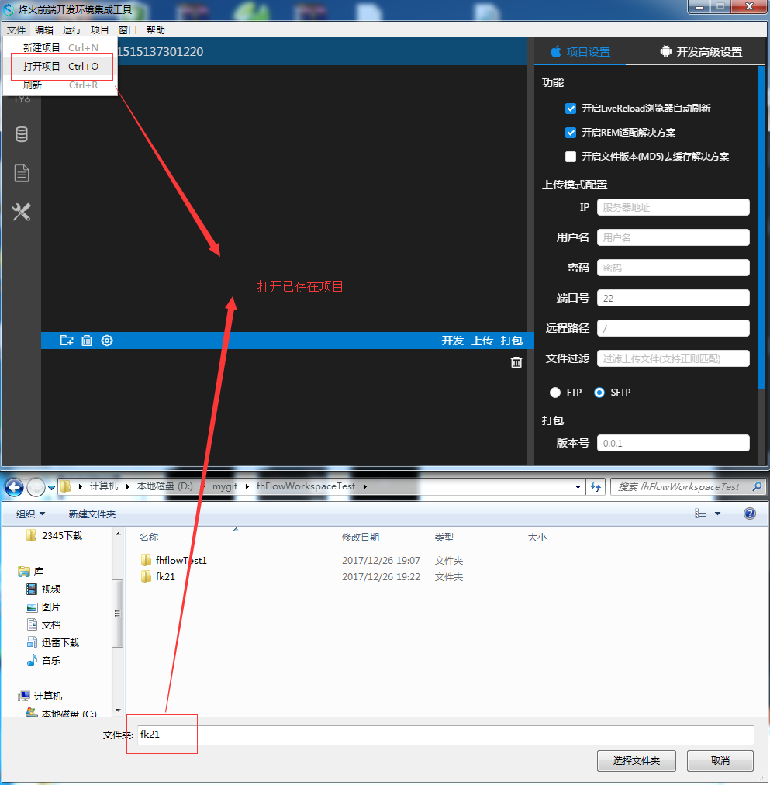

+ 删除项目

  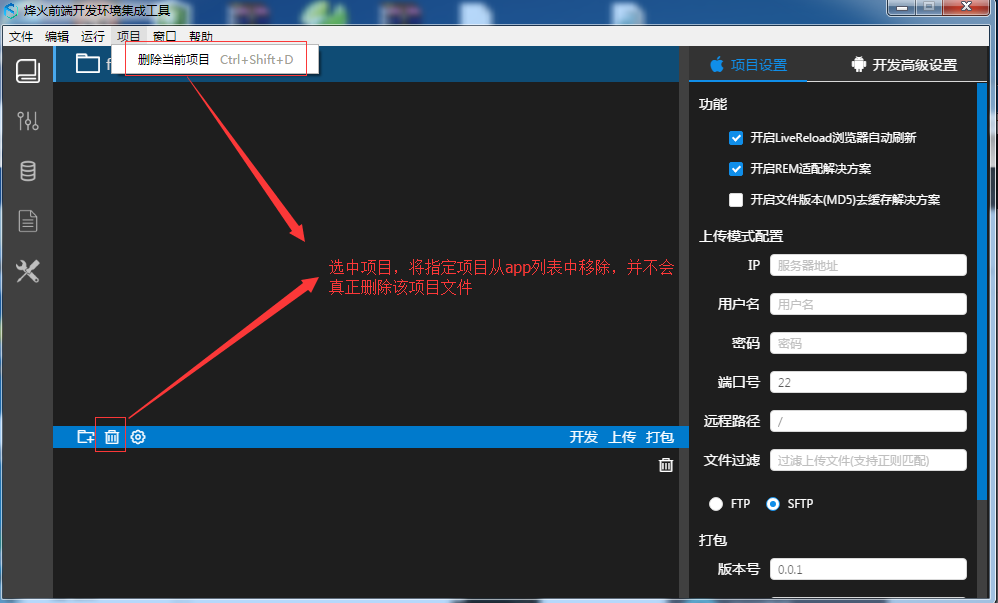

+ 开发模式

  选中项目点击开发按钮，该项目进度开发状态。在该模式下会将src目录中的文件按指定路径编译值build目录下（同时打印出日志），并监听src目录下的变化，当你在日志区看到`启动server成功`后说明项目编译完成。具体目录结构为：
     ```
	build（构建目录）
	├── assets   (静态文件)
	│   ├── fonts 
	│   ├── images 
	│   ├── css
	│   ├── js
	│   │ 	├── 模块js
	│   │ 	└── template
	│   │ 		└── helper.js
	│   ├── template
	│   │ 	├── 模块模板
	│   │ 	└── template.js
	│   ├── 平台html
    ```
+ 上传模式

    在该模式下会将build下的文件，过滤不需要的文件，去除rap后拷贝到release目录下，然后根据设置将release目录下的文件上传到服务器指定位置。**值得注意的是：点击上传按钮前请确认项目已经经过编译过程，生成了build文件夹**

+ 打包模式

    在该模式下会根据打包设置进行打包。需要注意的是如果需要模块化打包，请在开发高级设置勾选需要打包的模块，默认会打包所有模块。
	打包相关的设置除了项目设置面板中的'打包'设置外，功能模块的**开启REM适配解决方案**、**开启文件版本(MD5)去缓存解决方案**也是作用于打包过程的。

  
+ 项目设置面板

  1. 功能区，在此处可以通过勾选的方式选择是否开启浏览器自动刷新、REM适配、MD5去缓存等功能。

	  * 开启LiveReload浏览器自动刷新，自动刷新功能
	  * 在打开**开启REM适配解决方案**时，会将生成css文件替换为rem单位。
	  * 在打开**开启文件版本(MD5)去缓存解决方案**时，生成的项目名称将重新编译，从而达到去缓存的作用。

  2. 上传模式配置,设置上传相关的选项。在此处可以设置上传的IP、用户名、密码、端口号、远程路径、需要过滤的文件（此处支持正则），以及上传的方式（FTP/SFTP）

  3. 打包相关设置，可以设置版本号和命名规则以及选择打包类型（rar、zip），其中主要提供${name}、${moduleName}、${version}、${time}等参数，分别对应于项目名、模块名、版本号、时间，用户可自由组合，后台打包时会自动进行替换。

+ 开发高级设置
    
  开发高级设置,在此处对项目进行高级设置。
  
  1. 模块化选择，若项目为模块化项目请进行勾选。勾选后会自动对目录进行检测，如果检测不通过会发送windows通知**本项目不符合模块化项目结构**,如图 06所示。如通过，则会展示当前项目的所有模块并默认勾选，用户可根据需求自行勾选需要处理的模块，如图07所示。
  
  2. 项目类型选择，此处目前提供**普通**和**rhyton**两种，默认为普通项目 。
  
   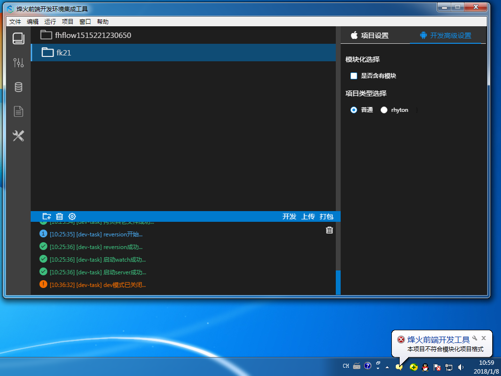

   <p align="center">图 06</p>

   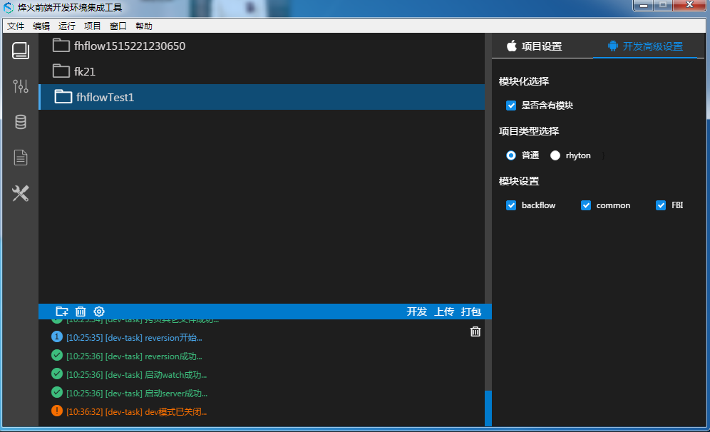  

   <p align="center">图 07</p>

#### 请求代理
  请求代理模块，提供代理设置,如下图09所示。头部主机名和端口号为默认项目启动时的主机名和端口号。点击新增按钮弹出新增代理请求弹框，写入匹配规则和目标地址后点击保存，即可生成代理规则，如图09所示。规则生成成功后会在列表中增加一条规则，用户可以在操作列中对规则进行编辑或删除，如图10所示。

   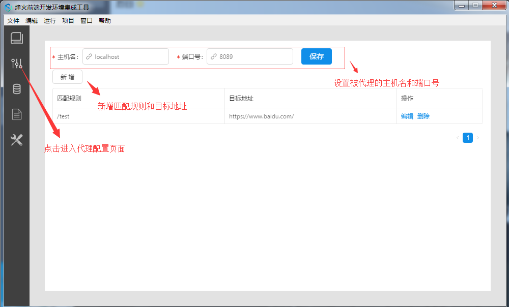

   <p align="center">图 08</p>

   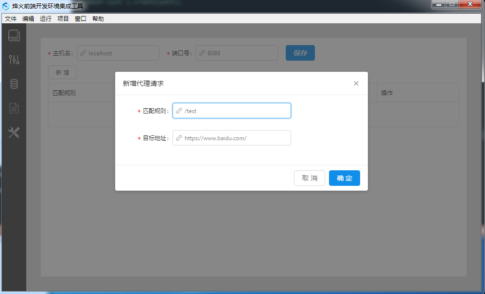

   <p align="center">图 09</p>

   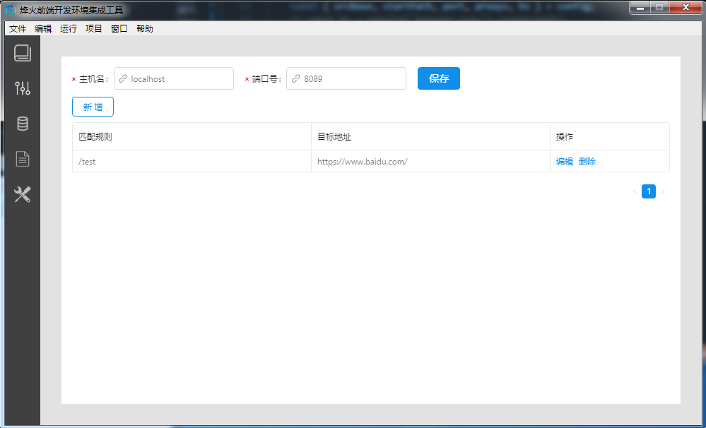

   <p align="center">图 10</p>

#### 数据模拟

  点击数据模拟进入数据模拟模块，如下图11所示。点击开始安装RAP，会跳转链接至rap的安装文档，用户可以参照文档进行安装。

  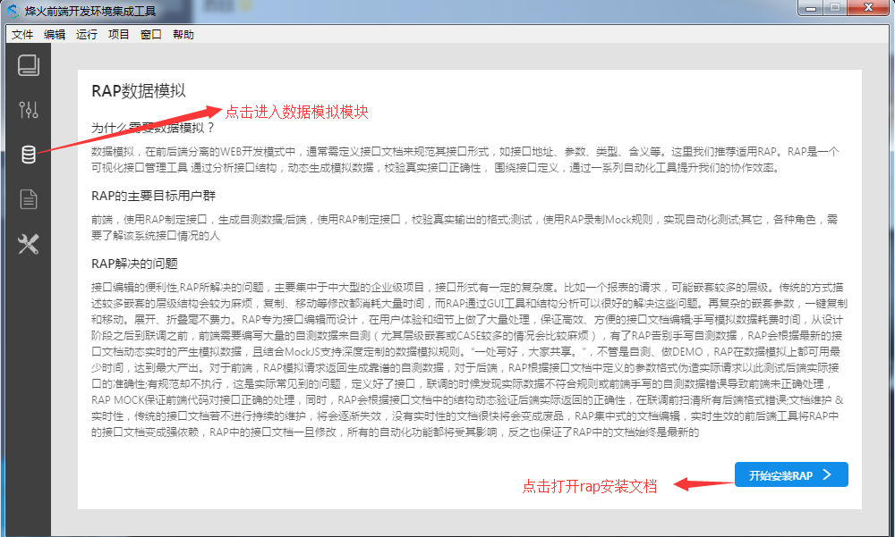

   <p align="center">图 11</p>

#### 开发文档

  点击开发文档图标进入开发文档模块。此模块提供了常用的开发文档，点击卡片中的查看按钮可进行替换，如下图12所示。

  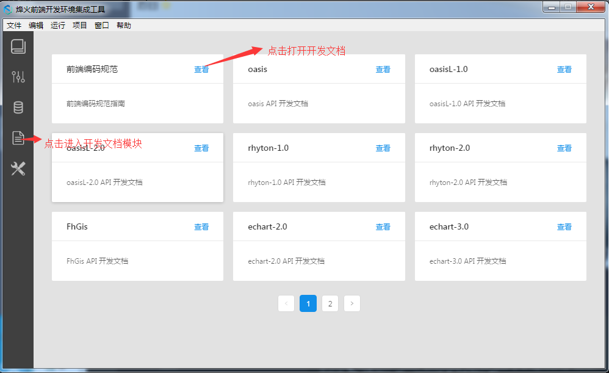

   <p align="center">图 12</p>

#### 开发环境安装

  点击开发坏境安装图标进入开发环境模块。该模块主要分为**开发环境检测安装**和**常用开发工具下载**两个部分，分别如下图13和图14所示。

  在开发环境检测安装部分。点击CHECK&INSTALL，会自动对当前机器的环境进行检测。若尚未安装会自动进行安装，当流程走到FINISH则说明安装完成；若已经安装流程会直接跳过进入下一项的安装，直到走到FINISH说明安装完成。

  在常用开发工具下载部分提供了常用开发工具的下载，点击卡片右上角的下载按钮可以进行工具的下载。

  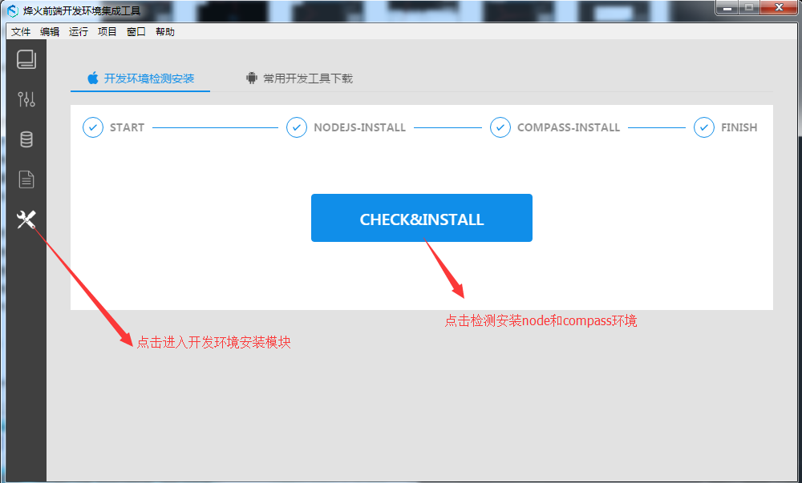

   <p align="center">图 13</p>


  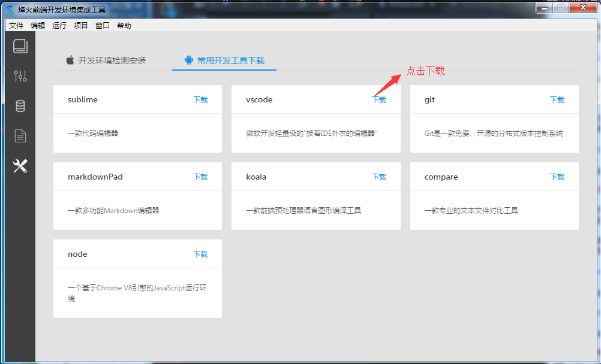

   <p align="center">图 14</p>

#### 项目脚手架
  新建项目成功后，会自动生成当前开发环境所需的目录结构

    fhflow.config.json  （存放项目的配置文件）
    src（开发目录）
    ├── fonts   (存放字体文件)
    ├── images （存放图片文件）
    ├── js	   （存放js文件）
    ├── scss   （存放scss文件）
    ├── tpl	   （存放tpl文件）
    ├── view   （存放html文件）
	
默认情况下，app会使用默认设置（即项目下fhflow.config.json的默认配置），当我们尝试修改app的配置时，将会对该配置文件进行修改。默认配置如下：

	{
      "businessName": "",
      "modules": [],
      "choseModules": [],
      "projectType": "normal",
      "supportREM": true,
      "supportChanged": false,
      "reversion": false,
      "server": {
        "host": "localhost",
        "port": 8089,
        "liverload": true,
        "proxys": []
     },
     "ftp": {
        "host": "",
        "port": "22",
        "user": "",
        "pass": "",
        "remotePath": "/",
        "ignoreFileRegExp": "",
        "ssh": false
     },
     "package": {
        "type": "zip",
        "version": "0.0.1",
        "fileRegExp": "${name}-${moduleName}-${version}-${time}"
     }
	}
	
  #### 注意点: 
1. iconfont 使用时规定了template模板名称为  项目名称icon.css,例如 godway项目中命名应该为godwayicon.css

2. 文件目录结构

* 非模块化项目目录结构
    ```
    ├── build
    ├── src
    │   ├── 其他(项目自己需要的文件目录)
    │   ├── icons
    │   │   ├── assets  (svg)  
    │   │   └── templates  (icon模板文件 projectName +"icon.css")  
    │   ├── images
    │   ├── scss
    │   ├── tpl
    │   ├── js
    │   └── view
    └── oasisl
   ```

* 模块化项目目录结构

    ```
    ├── build
    ├── src
    │   ├── 其他(项目自己需要的文件目录)
    │   ├── icons
    │   │    └── bussinessName
    │   │        └── common  (公共模块)  
    │   │           ├── assets  (svg)  
    │   │           └── templates  (icon模板文件 projectName +"icon.css")  
    │   ├── images
    │   ├── scss
    │   ├── tpl
    │   ├── js
    │   │    └── bussinessName
    │   │        ├── module1
    │   │        ├── module2
    │   │        ├── module3
    │   │        └── common  (公共模块)      
    │   └── view
    │       └── bussinessName
    │           ├── module1  (业务模块1)
    │           ├── module2  (业务模块2)
    │           ├── module3  (业务模块3)
    │           └── common   (公共模块)
    └── oasisl
    ```
    
3. 关于上传命令,默认端口为22 默认远程路径为'/',可根据具体情况进行修改。文件过滤出可以填写过滤规则,当有多个条件时使用";"隔开。例如：!D:\mygit\fhFlowWorkspaceTest\fhflowTest1\build\release\css\**;!D:\mygit\fhFlowWorkspaceTest\fhflowTest1\release\assets\css\

4. 关于打包名字,${name}为项目名称,${moduleName}模块名称,${version}版本号,${time}时间,打包时会自动替换。比如非模块项目,${moduleName}不存在,就不需要使用了。
